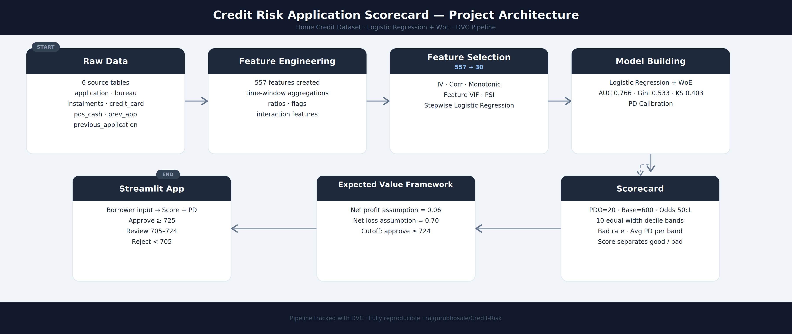
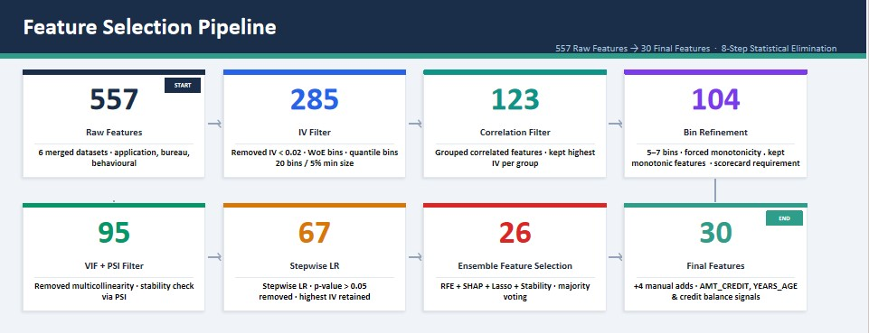

# 🏦 Credit Risk Application Scorecard

> A **Probability of Default (PD) Application Scorecard System** built on the Home Credit dataset — assessing borrower credit worthiness through statistical modeling and delivering an automated loan decision system.

---

## 📌 Problem Statement
Financial institutions receive thousands of loan applications every day.
To approve or reject these applications, they need a reliable and interpretable way to assess borrower creditworthiness — quickly, consistently, and in a manner that is explainable to regulators, analysts, and applicants.

## 🎯 Business Objective

Develop an interpretable Application Credit Scorecard to estimate Probability of Default (PD), enabling:

- Faster and consistent loan approval decisions
- Reduction in credit losses from high-risk borrowers
- Regulatory-compliant model explanations
- Risk-based customer segmentation

The model helps lenders make consistent, risk-aware, and profit-driven lending decisions.

---
## Introduction
This project implements a Credit Risk Application Scorecard using Logistic Regression
the industry-standard tool used by banks to estimate the **Probability of Default (PD)** for each applicant and translate it into a credit score that drives loan approval or rejection decisions.

### How it Works
The system takes a borrower’s financial and demographic information and returns a credit score.
The scorecard works through a simple lookup rule system — each feature value 
falls into a bin, and that bin returns a pre-assigned score point. All bin 
scores are summed with an intercept to produce the final credit score.

The output returns:
- **Credit Score** — total points from all feature bins
- **Loan Decision** — Approve, Review, or Reject based on score band
- **Risk Level** — how risky the applicant is at their score

# 🚀 Live Demo

👉 **[Credit Risk Scorecard System](https://credit-risk-scorecard-systemm.streamlit.app/)** — enter borrower details and get a real-time credit score, PD, and loan decision.

---
## 📂 Dataset

This project uses the **Home Credit Default Risk** dataset — a real-world credit risk dataset published on Kaggle, containing detailed financial, demographic, and behavioural information on loan applicants.

The model is trained on **7 merged tables**:
| Table                   | Description                                                                                          |
| ----------------------- | ---------------------------------------------------------------------------------------------------- |
| `application_train`     | Core applicant data — demographics, income, loan details                                             |
| `bureau`                | Applicant's past loans from other financial institutions                                             |
| `bureau_balance`        | Monthly balance history of bureau loans                                                              |
| `previous_application`  | Prior loan applications made at Home Credit                                                          |
| `installments_payments` | Repayment history on previous loans                                                                  |
| `credit_card_balance`   | Monthly credit card balance snapshots                                                                |
| `POS_CASH_balance`      | Monthly POS (Point of Sale) and cash loan balance history, including payment delays and DPD behavior |

Starting from **557 aggregated features** across these tables, the pipeline reduces to a final **30 features** through a rigorous feature selection process.

> 📎 Dataset source: [Home Credit Default Risk — Kaggle](https://www.kaggle.com/competitions/home-credit-default-risk)

# Project Workflow
## Project Architecture:

*Figure: Full project architecture  overview — from data ingestion to real-time loan decisioning.*

## Feature Selection Process

*Figure: End-to-end feature selection process — 557 raw features reduced to 30 final features across 8 elimination stages.*

## 🧮 Scorecard 
`Credit Score = Intercept Points + Σ Bin Scores` 
PDO: 20 · Base Score: 600 · Base Odds: 50:1 

The scorecard is validated across 10 score bands —
each reporting bad rate, average PD,  The bottom 2 bands capture 51% of all bad loans.
Higher scores indicate lower probability of default and lower credit risk.

All stages are tracked via DVC and fully reproducible.

A Streamlit app takes user input info and returns the credit score, PD, and loan decision for any borrower in real time.

---

## 📈 Model Performance

The model shows stable performance across train and test sets, indicating good generalization.

| Metric | Train | Test |
|---|---|---|
| AUC | 0.7659 | 0.7663 |
| Gini | 0.5318 | 0.5327 |
| KS | 0.3981 | 0.4032 |
| Brier Score (Calibrated) | 0.0676 | 0.0676 |

# Business Impact:

###  Cutoff Decision (Expected Value Framework)

Cutoffs are derived using an **Expected Value Framework** to ensure only profitable loans are approved.
git reflog
EV = (1 − PD) × Gain − PD × Loss
- Cost of approving a bad loan: 0.70
- Profit of approving a good loan: 0.06
- Optimal cutoff score: 725 (threshold above which loans generate positive expected profit)

### 🏦 Loan Decision Rules

Loan decisions are based on the final credit score:

| Credit Score | Decision | Risk Level |
|---|---|---|
| 748 and above | ✅ Approve | 🟢 Very Low Risk |
| 733 – 747 | ✅ Approve | 🟢 Low Risk |
| 725 – 732 | ✅ Approve | 🟠 Medium Risk |
| 705 – 724 | ⚠️ Manual Review | 🔴 High Risk |
| Below 705 | ❌ Reject | 🔴 Very High Risk |

> ⚠️The bottom 2 score bands (below 705) represent ~20% of applicants but contribute to 51% of total defaults

###  Business Value Delivered
* Better approval strategy: Uses a data-driven cutoff instead of fixed rules to decide which loans to approve
* Reduces losses: Filters out high-risk customers (bottom segments capturing 51% of defaults)
* Improves revenue: Keeps more good customers by not rejecting them unnecessarily
* Efficient process: Automatically approves/rejects most cases and sends only risky ones for manual review